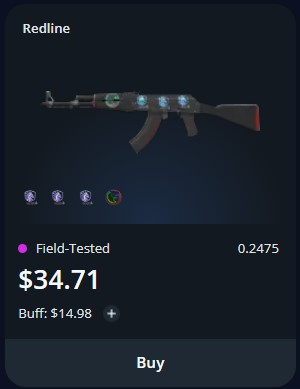

# GamerPay-Scraper

- This is a scraper for GamerPay.gg built using Python and Selenium
  - Search multiple links/queries at once.
  - Search for listings with specific sticker types (e.g. holo, foil, gold)
  - Save all listings that match filters in a existing or new .csv file
  - Email new listings to yourself

## GamerPay Listings:



- From a listing we can see:
  - Sale price
  - BUFF price (going price on market)
  - Stickers which can increase value of item

## Example email containing new listings:

<div id=":mw" class="ii gt" jslog="20277; u014N:xr6bB; 1:WyIjdGhyZWFkLWY6MTc5MjczNjQ5NDcyODQxMDYxMiJd; 4:WyIjbXNnLWY6MTc5MjczNjQ5NDcyODQxMDYxMiJd"><div id=":mv" class="a3s aiL "><table>
<thead>
<tr><th>name       </th><th>price/buff    </th><th>stickers                                                                                                                                        </th><th>link                                             </th></tr>
</thead>
<tbody>
<tr><td>Redline    </td><td>9.97 / 10.52  </td><td>['liq_holo berlin2019']                                                                                                                         </td><td><a href="https://gamerpay.gg/item/21205014?ref=marketplace" target="_blank" data-saferedirecturl="https://www.google.com/url?q=https://gamerpay.gg/item/21205014?ref%3Dmarketplace&amp;source=gmail&amp;ust=1709777262118000&amp;usg=AOvVaw3244xK3A85b2Rd1ME_0Dmd">https://gamerpay.gg/item/<wbr>21205014?ref=marketplace</a></td></tr>
<tr><td>Redline    </td><td>14.98 / 15.13 </td><td>['faze_holo stockh2021', 'faze_holo stockh2021', 'faze_holo stockh2021', 'faze_holo stockh2021']                                                </td><td><a href="https://gamerpay.gg/item/22803162?ref=marketplace" target="_blank" data-saferedirecturl="https://www.google.com/url?q=https://gamerpay.gg/item/22803162?ref%3Dmarketplace&amp;source=gmail&amp;ust=1709777262118000&amp;usg=AOvVaw3aQSh2xKrDtlJoVpwDz3ud">https://gamerpay.gg/item/<wbr>22803162?ref=marketplace</a></td></tr>
<tr><td>Redline    </td><td>15.03 / 10.52 </td><td>['sig_rickeh_foil berlin2019', 'sig_oskar_foil berlin2019', 'sig_rpk_foil berlin2019', 'stupid_banana_foil stickers2']                          </td><td><a href="https://gamerpay.gg/item/21315291?ref=marketplace" target="_blank" data-saferedirecturl="https://www.google.com/url?q=https://gamerpay.gg/item/21315291?ref%3Dmarketplace&amp;source=gmail&amp;ust=1709777262118000&amp;usg=AOvVaw2murUkdKiafzb3wyXX36Re">https://gamerpay.gg/item/<wbr>21315291?ref=marketplace</a></td></tr>
<tr><td>Redline    </td><td>16.35 / 11.78 </td><td>['sig_s1mple_holo stockh2021', 'god_holo stockh2021', 'god_holo stockh2021', 'god_holo stockh2021']                                             </td><td><a href="https://gamerpay.gg/item/14347588?ref=marketplace" target="_blank" data-saferedirecturl="https://www.google.com/url?q=https://gamerpay.gg/item/14347588?ref%3Dmarketplace&amp;source=gmail&amp;ust=1709777262118000&amp;usg=AOvVaw3iTa2vSoNXE_LJrDDPcJX6">https://gamerpay.gg/item/<wbr>14347588?ref=marketplace</a></td></tr>
</tbody>
</table><div class="yj6qo"></div><div class="adL">
</div></div></div>

# How to use:

- Install requirements (configure [ChromeDriver](https://sites.google.com/chromium.org/driver/) beforehand)

```
$ pip install -r requirements.txt
```

- Run using:

```
$ python main.py
```

- To add your own scrape link, in main.py, call:

```
 Scraper(page_url: str, file_path: str, sticker_filter: bool)
```

- page_url is the page to be scraped
- file_path is the name of the .csv file which will store the page listings
- sticker_filter is True if you want to filter out listings with stickers, else False.

To change the type of stickers to be saved, update self.special in Scraper **init** class.
To change what type of stickers to avoid with the special attributes, update self.avoid in Scraper **init** class.

If you do not want to run the script in headless mode, you can remove/comment the code in main.py: line 37-39.

## Email configuration:

if you would like the script to email you new listings, you must create an email.json file in the same directory as main.py. The email should be in the format:

```
{
    "email_sender": "sender@gmail.com",
    "email_password": "weird password from google",
    "email_receiver": "reciever@gmail.com"
}
```

Follow this [tutorial](https://youtu.be/g_j6ILT-X0k?feature=shared&t=25) to get your email_password. If there is not email.json file, the new listings will be printed to console instead.
